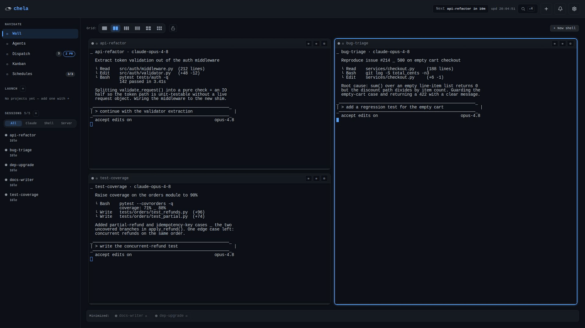
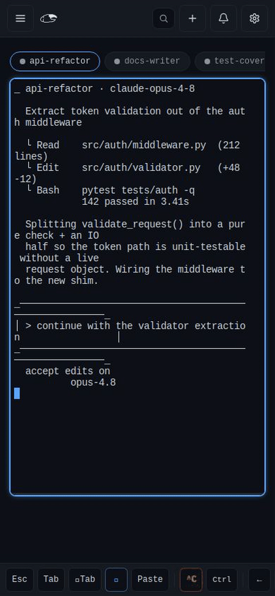
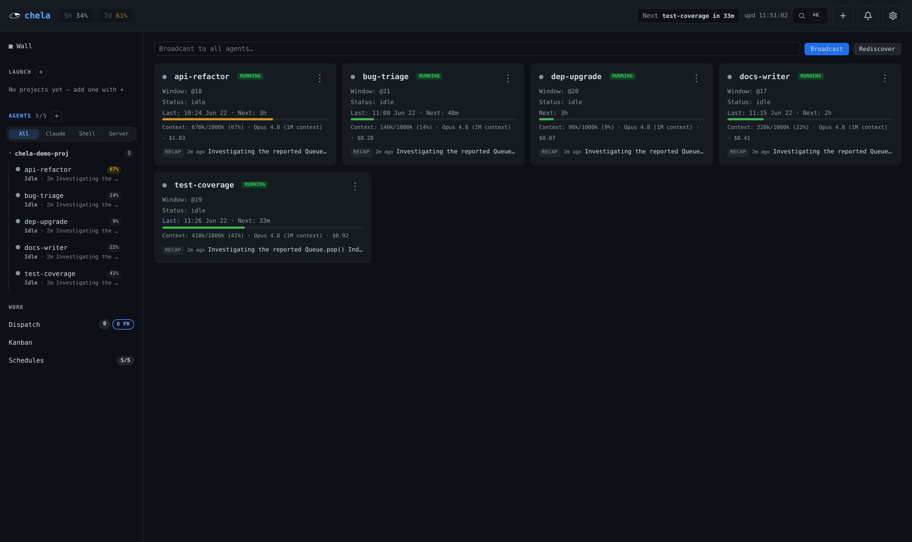
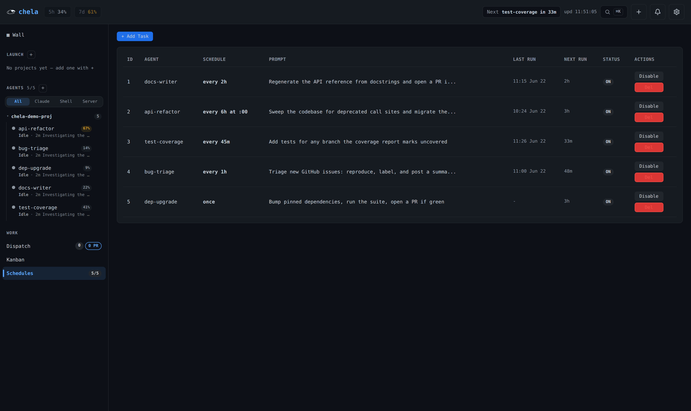

<p align="center">
  
</p>

<p align="center">
  <a href="LICENSE"></a>
  
  
  
</p>

# chelamux

**A tiny control plane that puts a fleet of Claude Code agents to work — unattended.**

chela runs as a small daemon over a single tmux session. It does three things:

- **Schedules** long-lived agents — poke an agent's pane on an interval or cron
  (`every 1h`, `0 */8 * * *`, a one-shot timestamp).
- **Dispatches** work — turn a markdown `TODO.md` (or GitHub issues) into one
  **git worktree per task**, spawn an agent in it, and let it **open a PR**.
- **Closes the loop** — when a delegated agent finishes (or blocks, or dies), the
  daemon **pushes that into the orchestrator agent's own session**, so an agent
  that gives out work learns when it comes back. See
  [the orchestration loop](#the-orchestration-loop).

Most tmux + Claude Code tools help you *talk to and supervise* agents; chela is
for **putting them to work** and walking away. You watch them however you
already watch tmux — `tmux attach`, [Mosh](https://mosh.org/), or the
**live terminal-wall dashboard**.

<table align="center">
  <tr>
    <td align="center" valign="top">
      <br>
      <sub>Desktop — the live wall, Dispatch, Kanban &amp; Schedules</sub>
    </td>
    <td align="center" valign="top">
      <br>
      <sub>Phone — single-pane, pill switcher, keybar</sub>
    </td>
  </tr>
</table>

<p align="center"><em>The dashboard, live — see it at <a href="https://chela.pages.dev">chela.pages.dev</a>.</em></p>

> Status: early. Core (scheduler + dispatcher + messaging) is solid and tested.
> The **dashboard + live terminal wall** is a first-class feature, shipped as a
> separate install (`--extra dashboard`) to keep the core lean for headless use.
> The wall streams live ttyd sessions and is **on by default but loopback-guarded**:
> it serves writable shells, so the dashboard only serves it on a `127.0.0.1`
> bind (the documented model — front it with a tailnet/SSH tunnel). A
> non-loopback bind refuses the wall unless you set `CHELA_TERMINALS_EXPOSE=true`.

---

## Features

- **Schedule agents** — poke any agent's tmux pane on an interval (`every 45m`),
  a cron expression (`0 */6 * * *`), or a one-shot timestamp. No human in the loop.
- **Dispatch TODOs → PRs** — turn each `- [ ] task` in a `WORKFLOW.md` / `TODO.md`
  (or a GitHub issue) into a git worktree on a fresh branch, spawn an agent to
  implement it, and let it open a PR.
- **Live terminal wall** — a web dashboard that streams every agent's pane (ttyd)
  into one grid, so you can watch the whole fleet work in real time.
- **Collaborative terminals (end-to-end encrypted)** — share any agent's live
  terminal over the internet with a link + a pairing code. It's **E2E-encrypted**
  (AES-256-GCM, keys derived in the browser from the code — the relay only ever
  sees ciphertext), **full-access** (watch, type, and scroll), and multi-user with
  live Figma-style cursors + a presence facepile. Mobile-friendly; revocable, with
  a one-tap Stop / Stop-All kill-switch.
- **Per-agent monitoring** — context-window usage, session cost, liveness
  (alive / working / waiting), latest recap, and next scheduled run, per agent.
- **Account-wide rate-limit pills** — the fleet shares one Claude account; the
  dashboard tracks the 5h / 7d limits so you can see headroom at a glance.
- **Needs-input alerts** — when an agent blocks on a prompt, chela fires a
  one-shot push (ntfy / Telegram / webhook) so you're not babysitting.
- **Decisions inbox** — an *orchestrator* agent that hands work to other agents
  gets told when that work finishes, blocks, or fails: the event is delivered
  into its own session, but only while it's idle. Without this, agent completion
  is invisible to an orchestrator (a Claude Code session only acts when something
  messages it), and a human ends up being the message bus.
- **Telegram bridge** — one forum topic per agent window: drive or supervise any
  agent from your phone, two-way (`chela telegram`; see
  [`skills/telegram-setup`](skills/telegram-setup/SKILL.md)).
- **tmux-native discovery** — windows are agents; `tmux list-windows` is the
  single source of truth. No external registry, no heartbeat daemon.
- **Lean core, optional dashboard** — a two-dependency headless core; the Flask
  dashboard + terminal wall is a separate `--extra dashboard` install.

---

## Install

chela uses [`uv`](https://docs.astral.sh/uv/). The core has two small deps
(`croniter`, `pyyaml`); the **dashboard + live terminal wall** ships as a
**separate install** (adds Flask) — same feature, kept out of the core so a
headless/CLI-only setup stays lean.

```bash
git clone https://github.com/Devail1/chelamux && cd chelamux
uv sync                       # core only — no Flask
uv run chela status

# dashboard + live terminal wall (separate install — keeps the core lean):
uv sync --extra dashboard
```

Requirements: Python ≥ 3.11, `tmux`, `git`, the `claude` CLI on `PATH`
(plus `gh` for the dispatcher's PR flow).

**Authenticate Claude once.** chela doesn't manage credentials — it drives the
`claude` CLI inside your tmux windows. Log in once on the machine (`claude`, then
`/login` — or `claude setup-token` for a headless/long-lived token); every agent
window reuses the cached `~/.claude` credentials. The whole fleet therefore runs
as **one Claude account** and shares its 5h / 7d rate limits (which is exactly
what the dashboard's rate-limit pills track).

---

## Run

```bash
# 1. Make a tmux session whose windows are your agents (the window name is the
#    agent's display name). Override the session name with CHELA_TMUX_SESSION.
tmux new-session -d -s chela -n researcher

# 2. See what chela can see:
uv run chela status

# 3. Schedule an agent:
uv run chela schedule add researcher --every 1h --prompt "Run your research cycle."

# 4. Start the daemon. NOT OPTIONAL — it is what makes chela do anything on its
#    own (see below). Run it under a process manager (pm2/systemd/tmux window):
uv run chela run

# 5. Dispatch work items from a repo's WORKFLOW.md (see examples/):
uv run chela dispatch /path/to/repo/WORKFLOW.md --once    # one pass
uv run chela dispatch /path/to/repo/WORKFLOW.md           # poll
```

**`chela run` is the engine, not a helper.** Everything autonomous lives in its
loop, so if it isn't running, chela is just a CLI. Each pass it:

| It runs | Without the daemon |
|---|---|
| the **scheduler** tick | schedules never fire — no interval/cron pokes |
| the **dispatcher** (for `CHELA_DISPATCH_WORKFLOWS`) | TODOs are never turned into worktrees/PRs |
| the **needs-input** scan | no push when an agent blocks on a prompt |
| the **decisions inbox** | a finished agent never wakes the orchestrator |
| the **window-name reconciler** | windows stay stuck at `shell-N` instead of their project |

The daemon is easy to *forget* you killed — the dashboard still works, agents
still run, and nothing looks broken; the fleet just quietly stops doing anything
by itself. If schedules seem "stuck", check that `chela run` is alive first.

The **dispatcher** is the headline feature. Drop a `WORKFLOW.md` + `TODO.md` in
a repo (copy `examples/`), and each `- [ ] task` becomes: a worktree on a fresh
branch → an agent that implements it, strikes the line, and opens a PR → a run
that flips to `done` when you merge. See [`examples/WORKFLOW.md`](examples/WORKFLOW.md).

> **Prefer to have an agent set it up?** Copy
> [`skills/chela-setup`](skills/chela-setup/SKILL.md) into `~/.claude/skills/` and
> a Claude Code agent can install chela and seed a starter `WORKFLOW.md` + `TODO.md`
> for the current repo for you.

---

## The orchestration loop

An **orchestrator** is just another agent — a Claude Code session whose job is to
hand work to the others. It has a structural blind spot: a Claude Code session can
only act when something messages it, so an agent *finishing* is invisible to it. It
has to poll the pane, or a human has to walk over and say "he's done". The decisions
inbox closes that: completion is pushed back into the orchestrator's session.

```bash
# in the orchestrator's session, after dispatching work to window @3:
chela drive @3 "Fix the parser bug in src/lex.rs; commit when tests pass."
chela watch @3 --note "parser bug"     # register interest — you'll be told
chela watching                         # what's watched + what's queued
```

The daemon then reports, once, when `@3` **finishes**, **blocks** on a prompt, or
**dies** mid-task — plus dispatcher runs that hit `awaiting_review`, `failed`, or
`needs_human` (the rework loop gave up — every verdict it was given rides along) —
as one line typed into the orchestrator's session:

```
📥 @3 (chelamux) finished the task you dispatched — verify + commit. — note: "parser bug"
```

Three rules make pushing into a live session safe:

- **Delivery is gated on `idle`, strictly.** A `busy` session is mid-thought and is
  never interrupted — the event queues durably and goes out on the next idle tick.
  A **`waiting`** session is worse than busy: it's sitting on a permission prompt,
  and a paste there would be read as the *answer to that prompt*. So `not busy` is
  not good enough; only a genuinely idle session is ever written to.
- **You must register interest.** Every agent turn ends busy→idle, including the
  orchestrator's own replies, so only work you explicitly `chela watch`ed produces
  an event. This also covers plain `chela drive` / `tmux send-keys` delegation,
  which isn't a dispatcher run and has no run state of its own. The watch clears
  when the completion fires: one dispatch, one report.
- **The orchestrator is identified explicitly, never guessed.** Whichever session
  runs `chela watch` registers itself (via `$CHELA_WID`); pin it with
  `CHELA_ORCHESTRATOR_WID=@0`. Until something registers, the inbox is **inert** —
  it can't push into a random agent's session. It never reports on the
  orchestrator's own window either, so it can't notify itself in a loop.

Kill it entirely with `CHELA_INBOX_ENABLED=false`.

---

## Agent rooms — agents that can actually talk to each other

`chela msg` fires a string into a pane and vanishes: no record, no kind, no reply
path. A **room** is the relationship that message never had — a typed, durable
ledger two or more windows are members of, plus **active dispatch**: a *targeted*
`handoff` / `question` / `blocker` is injected into the peer's terminal, so it wakes,
answers, and the answer routes back to the asker **with no human in the middle**.

```bash
chela room create wire
chela room join wire --wid @3            # no --wid: your own window
chela room join wire --wid @4
chela room post wire --kind question --from @3 --to @4 \
  -- "Does the retry live in the parser or the client?"
chela room digest wire                   # the ledger — read from the event log
```

`@4` finds this typed into its prompt, and the command it needs to answer with:

```
[chela room] question from @3 (parser) in room "wire" (post #128):
> Does the retry live in the parser or the client?

Answer by posting back to the asker — this wakes them, with no human in the middle:
  chela room post wire --kind handoff --from @4 --to @3 --reply-to 128 -- "<your answer>"
```

- **A room is membership + a filter over the [event log](docs/EVENTS.md)** — every
  post is one event (`room_<kind>`), so there is no second event store to drift.
  Only the *membership* gets a file of its own (`$CHELA_DIR/rooms.json`): it is
  mutable, and the log is append-only and rotates.
- **Only a targeted `handoff`/`question`/`blocker` may interrupt.** Every other kind
  (`status`, `finding`, `summary`, `task`, …) is recorded and never injected, and an
  untargeted post is never injected at all — a fleet where any post can paste into
  any pane is an interrupt storm.
- **The inbox's rails, reused.** A `waiting` agent is *never* pasted into (that paste
  would answer its gate) — the delivery is **parked** and goes out when the gate
  clears. A dead or unknown recipient fails loudly, exit 1. Messaging yourself is
  refused.
- **The loop guard is structural, not advisory** — an echo between two live agents
  burns a real machine. A relayed prompt can never be re-posted (every injected
  prompt opens with a fixed `[chela room]` header), a reply chain is capped at 6
  hops, and no window may be injected into by the same peer more than 6 times in 5
  minutes. A tripped guard still *records* the post; it just wakes nobody.
- **A body is untrusted input on its way into a terminal.** ANSI escapes and control
  characters are stripped, the body is capped and **quoted**, so a `/slash-command`,
  an `Escape` or a `Ctrl-C` in a message can't drive the recipient's TUI.
- **A restarted agent is handed its rooms back.** Everything a room told an agent lived
  in that *session's* context — and a dispatched agent is a fresh session every run, so a
  restart forgot the lot, silently. The plugin's `SessionStart` hook now injects a short
  recap (`chela room recap` prints the same thing): the last few posts per room, newest
  first, sanitised, with the `--reply-to` cursor to answer on. An agent in **no** room
  gets **nothing** — not a header, not a "no shared context" line — because this text is
  prepended to every fresh context in the fleet. See [docs/HOOKS.md](docs/HOOKS.md).

---

## Agent autonomy (permission modes)

chela never manages permissions itself — it just launches `claude`, so the
agent's autonomy is set by the `claude --permission-mode <mode>` it's started
with. The modes (`claude --help`):

| Mode | Behaviour | Good for |
|---|---|---|
| `default` | Asks before every non-trivial action | Watching closely / untrusted repo |
| `plan` | Read-only; proposes a plan, changes nothing | Scoping before you let it run |
| `acceptEdits` | Auto-accepts file edits, still gates the rest (commands, etc.) | "Accept edits on" — light supervision |
| `auto` | A classifier auto-approves safe ops and gates dangerous ones | **chela's dispatcher default** — rarely hangs, still gated |
| `dontAsk` / `bypassPermissions` | No gating at all | Zero-hang autonomy on a repo you fully trust |

Two launch paths set the mode independently — **this is the part to know:**

- **Dispatcher agents** read `agent.cmd` from each repo's `WORKFLOW.md`
  (version-controlled, per-repo). Default: `claude --permission-mode auto`.
- **Dashboard Start button / launcher** use the `CHELA_AGENT_CMD` env (global).
  Default: plain `claude`, i.e. **`default` mode — it asks on every action**, so
  a launched agent you're not watching will sit waiting on a prompt.

To change the launcher/Start default, set the full command, e.g.
`export CHELA_AGENT_CMD="claude --permission-mode acceptEdits"` (or `auto`), then
restart the daemon. Prefer `auto` or `acceptEdits` for agents on a wall you don't
babysit; reserve `bypassPermissions` for repos you fully trust.

---

## CLI

| Command | What it does |
|---|---|
| `chela status` | List the agent windows chela sees in the tmux session |
| `chela run` | **The daemon.** Every pass: scheduler tick · dispatcher · needs-input scan · [decisions inbox](#the-orchestration-loop) · window-name reconcile. Required — see [Run](#run) |
| `chela schedule add <agent> --every/--cron/--once --prompt ...` | Add a scheduled poke |
| `chela schedule list` / `remove <id>` | Manage scheduled tasks |
| `chela dispatch <WORKFLOW.md> [--once] [--interval N] [--dry-run]` | Run the work-item dispatcher |
| `chela dispatch --pause [--reason R] [--ttl 30m]` / `--resume` / `--hold-status` | **Hold the queue** while you reorder the tracker: claims stop, reconciliation continues, and the hold self-releases at its expiry |
| `chela dispatch-runs [--awaiting]` | List dispatcher runs; `--awaiting` shows everything parked in review (awaiting review, sent back, needs a human) |
| `chela review <run\|branch> --request-changes --body-file -` | **Fail a PR and send it back**: the run re-enters its *own* worktree and branch, with your verdict as the prompt. `--approve` records a pass and merges nothing |
| `chela task-finished <task_id>` | (agent uses this) mark a run awaiting-review + kill its window |
| `chela msg <agent> <text> [--from] [--priority]` | Message a live agent over tmux (by window id `@32` or name; non-zero exit if not delivered) |
| `chela broadcast <text>` | Message every other live agent |
| `chela telegram [--no-inbound]` | Bridge agent windows ↔ Telegram forum topics (see [`skills/telegram-setup`](skills/telegram-setup/SKILL.md)) |
| `chela install-statusline [--write]` | Print/install the Claude Code statusLine hook for the context bar |
| `chela dashboard [--host] [--port]` | Launch the dashboard + live terminal wall (needs the `[dashboard]` install) |
| `chela knowledge export [--out DIR] [--since DATE]` | Write an [OKF](docs/OKF.md) bundle of runs / schedules / agents / projects |
| `chela events [--after-seq N] [--type T] [--wid @N] [--follow]` | Replay / filter / tail the [event log](docs/EVENTS.md) — the durable record of what happened |
| `chela events rotate [--yes]` | Retire the log to a `.bak` and start a fresh `boot_id` (an operator step — never silent) |
| `chela plugin [--dir PATH] [--port N]` | Render the [Claude Code hooks plugin](docs/HOOKS.md) that feeds the event log |
| `chela doctor` | Check the running config against `~/.chela/chela.env` — [drift is silent otherwise](docs/CONFIG.md) |

**Agent-facing** — an agent runs these *about its siblings*, from inside its own
window (it knows itself via `$CHELA_WID`, injected at spawn):

| Command | What it does |
|---|---|
| `chela whoami` | Print this agent's own window id (`$CHELA_WID`) |
| `chela peek [wid]` | Status of a window: liveness, cwd, latest recap, health (default: self) |
| `chela read [wid] [--tail N \| --query Q \| --all]` | Distilled read of a sibling's Claude Code transcript |
| `chela drive <wid> <message>` | Message a sibling window, keyed by window id (rename-proof) |
| `chela watch <wid> [--note "..."]` | Delegated work to `<wid>`: tell me when it finishes / blocks / dies, and register me as the orchestrator |
| `chela watching` | What's being watched, and what's queued for delivery |
| `chela unwatch <wid>` | Stop watching a window |
| `chela room create <room>` | Create a room (a shared, typed ledger some windows are members of) |
| `chela room join <room> [--wid]` | Put a window in a room (default: your own) |
| `chela room post <room> --kind K [--to @N] [--reply-to SEQ] <text>` | Post to a room — a *targeted* `handoff`/`question`/`blocker` **wakes** the peer; every other kind is recorded only |
| `chela room digest <room>` | The room's ledger, read from the event log |
| `chela room status [room]` | Rooms, their members, and any delivery parked at a gate |
| `chela room leave <room> [--wid]` | Remove a window from a room |

---

## Config (environment)

The environment is the single source of truth, and it is written down in **one file**:

```bash
cp examples/chela.env ~/.chela/chela.env    # sourced by chela and by scripts/run-chela.sh
chela doctor                                # does what's RUNNING still match the file?
```

An exported variable beats the file; the file beats the defaults; and chela runs correctly
from a plain shell with neither. Nothing else keeps a copy — a process manager's `env:`
block is a second place for config to live, and that is where drift comes from. Start
services with `scripts/run-chela.sh` (see `examples/ecosystem.config.js`), and read
**[docs/CONFIG.md](docs/CONFIG.md)** for the precedence rules, the PM2 migration, and why
the dashboard *publishes* the port it bound.

| Variable | Default | Purpose |
|---|---|---|
| `CHELA_TMUX_SESSION` | `chela` | tmux session chela orchestrates |
| `CHELA_DIR` | `~/.chela` | State dir (scheduler.db, worktrees, context) |
| `CHELA_ENV_FILE` | `$CHELA_DIR/chela.env` | The env file itself. Empty = don't read one |
| `CHELA_SCHEDULER_POLL_INTERVAL` | `30` | Daemon loop interval (s) |
| `CHELA_DISPATCH_WORKFLOWS` | — | Colon-separated WORKFLOW.md paths the daemon dispatches |
| `CHELA_DISPATCH_TICK_INTERVAL` | `60` | Dispatcher tick interval in the daemon (s) |
| `CHELA_MAX_REWORKS` | `2` | How many times a PR that fails review is sent back to its agent before the run stops at `needs_human`. `0` = no rework at all |
| `CHELA_AGENT_CMD` | `claude` | Launch command for the dashboard Start button |
| `CHELA_PROJECTS_DIR` | `~/projects` | Folder scanned for git repos to suggest in the Launch sidebar (also settable in dashboard **Settings → Projects folder**, which wins) |
| `CHELA_NOTIFY_URL` | — | Needs-input notification target (ntfy / Telegram / webhook) |
| `CHELA_NOTIFY_KIND` | auto | Force `ntfy` \| `telegram` \| `webhook` |
| `CHELA_NOTIFY_CHAT_ID` | — | Telegram chat id (if not in the URL) |
| `CHELA_NOTIFY_INTERVAL` | `20` | Pane-state scan interval (s) |
| `CHELA_INBOX_ENABLED` | `true` | [Decisions inbox](#the-orchestration-loop). Inert until a session registers as the orchestrator; `false` disables it outright |
| `CHELA_ORCHESTRATOR_WID` | — | Pin the window the inbox pushes into (`@0`). Otherwise it's whichever session ran `chela watch` |
| `CHELA_IGNORE_WINDOWS` | — | Comma-separated window names to hide from discovery (placeholder/keep-alive windows) |
| `CHELA_SHOW_TOOL_CALLS` | `false` | Relay each agent's tool calls to Telegram too (noisy; off by default) |
| `CHELA_STATUS_LINE` | `true` | Relay the live "Claude is working" verb (`✻ Cerebrating… · 2 shells`) as one self-updating message per topic. It edits in place while the agent works and clears itself when the turn ends — so a phone can tell a *thinking* agent from a *dead* one. A finished turn is kept only when it still says something (shells still running, or a turn ≥30s); anything shorter poofs |
| `CHELA_DASH_HOST` / `CHELA_DASHBOARD_PORT` | `127.0.0.1` / `5001` | Dashboard bind. The hooks plugin POSTs to this port, so set it **here**, not with `chela dashboard --port` (a per-process override nothing else can see) |
| `CHELA_TERMINALS_ENABLED` | `true` | Embedded ttyd terminal wall (streams live; loopback-guarded — see below) |
| `CHELA_TERMINALS_EXPOSE` | `false` | Serve the writable wall on a **non-loopback** bind too (RCE risk — opt-in) |
| `CHELA_DEFAULT_CONTEXT_WINDOW` | `200000` | Window size assumed by the transcript-based context estimate (fallback only) |

---

## Needs-input notifications

When an agent's pane enters the `waiting` state (blocked on a permission prompt
or a question), chela fires a one-shot notification — so you don't have to babysit.

```bash
export CHELA_NOTIFY_URL=https://ntfy.sh/my-chela-topic              # ntfy
export CHELA_NOTIFY_URL="https://api.telegram.org/bot<token>/sendMessage?chat_id=<id>"  # Telegram
export CHELA_NOTIFY_URL=https://example.com/hook                    # generic JSON webhook
```

Transport is auto-detected from the URL; it's edge-triggered (one ping per
entry into `waiting`, not per tick). Pair it with ntfy on your phone for a
push-to-pocket "your agent needs you" alert.

---

## Context & rate-limit tracking

The dashboard shows each agent's **context-window usage** and the account-wide
**5h / 7d rate-limit** pills. Those numbers live only in Claude Code's statusLine
payload (they aren't in the transcript), so chela ships a tiny statusLine hook
that caches the payload to `$CHELA_DIR/context/<window>.json`:

```bash
chela install-statusline           # prints the snippet to add to settings.json
chela install-statusline --write   # writes it for you (won't clobber an existing one)
```

It's optional. Without it, the context bar falls back to a coarser estimate
derived from the agent's transcript (no rate-limit pills, and the window size is
a guess — see `CHELA_DEFAULT_CONTEXT_WINDOW`). Install the hook for exact numbers.

---

## Remote access & security

**chela ships with zero built-in auth, by design.** The dashboard and the ttyd
terminals bind `127.0.0.1`. The terminal wall is a *writable shell* — exposing
it on an untrusted network is remote code execution. **The tailnet is the trust
boundary**, not a password.

For remote access, put the loopback dashboard behind one of:

- **[Tailscale](https://tailscale.com/)** — `tailscale serve 5001` gives you TLS
  + tailnet ACLs for free (recommended).
- An **SSH tunnel** — `ssh -L 5001:127.0.0.1:5001 host`.
- A reverse proxy **with your own auth**.

**Watch from your phone** without the web UI at all: SSH/Mosh into the box from
a mobile terminal — [Blink](https://blink.sh/) (iOS), [Termius](https://termius.com/),
or any Mosh-capable client — then `tmux attach -t chela` and you've got the live
panes. A QR of the connect string makes this one tap.

**Or bridge the fleet to Telegram.** `chela telegram` maps each agent window to a
**forum topic** in one supergroup — 1 topic = 1 window = 1 session — and relays
both ways: the agent's output streams into its topic, and anything you type there
lands in its pane. Topics are created, named after the agent's project, and closed
as windows come and go; a rename of the window renames the topic. So you can drive
or supervise any agent from your phone, not just get pinged by it. Setup (bot
token, forum group, PM2): [`skills/telegram-setup`](skills/telegram-setup/SKILL.md).

> The bridge is text/media over the Bot API — it needs no inbound port and doesn't
> expose the wall. It's a supervision channel, not a substitute for the tailnet
> boundary above.

### Collaborative terminals (end-to-end encrypted)

The remote access above is for watching *your own* fleet. chela can also **share a
live terminal with someone else** — a teammate, a pairing partner, another of your
own devices — over the public internet, without exposing your machine. Click
**Share** on any pane (or "Share current session" from the dashboard's ⋮ menu on
mobile) and you get a **join link** + a short **pairing code**; whoever has both
opens the link in a browser and is in the same session — **full access: watch,
type, and scroll** — and everyone sees each other as live, labeled cursors plus a
presence facepile.

It's **end-to-end encrypted**, and the relay in the middle is **zero-knowledge**:

- **The pairing code is the key — and it never leaves the browsers.** The code is
  16 random bytes (shown as base32). Both ends derive AES-256-GCM keys from it with
  HKDF-SHA256 — directional keys for the terminal stream and a symmetric group key
  (`k_pres`) for presence — entirely in-browser. A wrong code simply fails to
  decrypt (you get "wrong code", not garbage).
- **The relay only ever sees ciphertext.** It's a dumb, opaque WebSocket fan-out
  (one room per share) that broadcasts frames it cannot read — it never holds a
  key. It sees **metadata only**: the room name (derived from your tmux session +
  window id — *not* a secret) and message timing/size. The pairing code is the sole
  security boundary, so a *guessed* room just yields undecryptable frames.
- **Run your own relay for metadata privacy.** Point `CHELA_COLLAB_RELAY` at your
  own Cloudflare Worker — the relay source ships in
  [`chela/collab-relay/`](chela/collab-relay) — so even that metadata stays yours.
  It defaults to **empty**: sharing is **off until you set it**, and chela never
  phones home.
- **Revocable.** Stopping a share kills the room and rotates the code. A global
  active-shares indicator in the topbar gives you one-tap **Stop** / **Stop-All**.

**Full access is the model:** a paired joiner holds the code, so they can both
watch and drive (scroll is input on a full-screen TUI). Share only with people
you'd hand the keyboard to.

---

## Dashboard & live terminal wall

A first-class feature, shipped as a separate install to keep the core lean.
`uv sync --extra dashboard && uv run chela dashboard` serves a web UI on
`127.0.0.1:5001` with five views — **Feed** (the [event log](docs/EVENTS.md)),
**Agents** (liveness from `claude agents --json`: alive / waiting / offline),
**Wall**, **Work** (the dispatcher, a Kanban of runs, and schedules, over one
poll), and **Knowledge**. Every view is one entry in a registry
(`static/js/views.js`), so a view is as cheap to delete as it is to add.
Liveness is derived live from the native session status — no heartbeat daemon.
An embedded ttyd **terminal wall** (a multi-pane view that streams the
live panes) is **on by default**, but **loopback-guarded**: because it serves
writable shells, the dashboard only serves it on a `127.0.0.1` bind. Bind to a
non-loopback interface (e.g. `--host 0.0.0.0`) and the wall is refused — its
routes 404 and its UI is hidden — unless you explicitly set
`CHELA_TERMINALS_EXPOSE=true`. Turn the wall off entirely with
`CHELA_TERMINALS_ENABLED=false`.

<p align="center">
  
  <br>
  <em>Agents view — context usage, cost, liveness, latest recap and next run, per agent.</em>
</p>

<p align="center">
  
  <br>
  <em>Schedules — interval, cron, and one-shot pokes that type a prompt into an agent's window.</em>
</p>

**Renaming an agent.** Double-click a pane's title on the wall. That renames the
**tmux window** — the window name is the single source of truth for an agent's
name — so it updates everywhere at once: the wall, the agent cards, the nav, tmux
itself, and the agent's bound Telegram topic. It sticks: chela's auto-namer only
fills in *blank* names (a placeholder `shell-N`, or a name tmux derived from the
running command), and never overrides one you chose.

**Keys not reaching the terminal?** If `Esc` (or other keys) never reaches an
embedded terminal, a vim-style browser extension such as **Vimium** is almost
certainly capturing them at the page level — it injects into the terminal's
iframe too. Fix: exclude the dashboard's URL in the extension's settings (in
Vimium, *Options → "Excluded URLs and keys"* → add the dashboard URL and leave
the *Keys* field blank). Quick workaround: `Ctrl+3` (or `Ctrl+[`) sends a
literal Escape.

### HTTP API (selected)

| Route | Returns |
|---|---|
| `GET /api/agents` | Per-window liveness/health, session status, context, schedules |
| `GET /api/summary` | Header counts (agents online, schedules) |
| `GET /api/schedules` · `POST` · `DELETE/PATCH /<id>` | Scheduled tasks CRUD |
| `GET /api/dispatcher` | Open tasks + active/awaiting/recent runs per workflow |
| `POST /api/dispatcher/runs/<id>/merge` · `/merge-all` | Squash-merge PRs + clean up |
| `POST /api/agents/{start,stop,restart,msg,broadcast,trigger}` | Agent controls |
| `GET /api/events` | Server-Sent Events stream (reactive UI accelerator) |

---

## How it works

- **Discovery is tmux-native.** `tmux list-windows` + `pane_current_path` are
  the single source of truth — no external state file, no daemon to coordinate
  with. tmux never lies about what's live right now.
- **The dispatcher** keys each task by a stable SHA of its source line, creates
  `~/.chela/worktrees/<...>/` per task on branch `<project_key>-<n>`, and tracks
  runs in `~/.chela/scheduler.db`. Dispatched agents default to
  `claude --permission-mode auto` (a classifier auto-approves safe ops and gates
  dangerous ones); set `agent.cmd: claude --permission-mode bypassPermissions`
  in `WORKFLOW.md` for zero-hang autonomy on a repo you trust.
- **A PR that fails review goes back to the agent that wrote it.** `awaiting_review` used
  to be the end of the line: the reviewer found real defects and had nowhere to put them,
  so a human climbed into the worktree and hand-started a fix agent. Now
  `chela review <run> --request-changes --body-file -` writes the verdict on the run and
  the next tick re-spawns that agent **in its original worktree, on its original branch**,
  with the verdict as its prompt — so the branch history and the open PR survive, and the
  PR simply updates when it pushes. The loop is **bounded** (`CHELA_MAX_REWORKS`, default
  2): past the cap the run stops at `needs_human`, keeping its branch, worktree and PR, and
  surfaces to you through the [decisions inbox](#the-orchestration-loop) carrying *every*
  verdict it was given. A rework draws on the same `concurrency.max` slots as any other
  work — it never preempts a running agent, and a run that has stopped never holds a slot.
  ⚠️ **The run row is the authority, not GitHub**: `gh pr review --request-changes` is
  refused on a PR your own account authored, and a fleet is one account — so the verdict
  lives on the run and the PR comment is its human-readable copy.
  ⚠️ **Rolling the daemon back is a ONE-WAY door while a run is parked.** `changes_requested`
  and `needs_human` are new statuses, and an older dispatcher's claim filter has never heard
  of them: it sees a parked run's task still open in the tracker, claims it as a **fresh**
  one, forks a **second** worktree off the base branch and dispatches the *original* prompt
  — telling an agent to branch and open a PR that is already open. Before downgrading, drain
  the loop: `chela dispatch-runs --awaiting` lists every parked run; merge, close or
  `chela runs delete` each one first.
- **The queue belongs to whoever holds it, not to whoever is faster.** The tracker
  has two writers — you reorder it, the dispatcher claims from it — and you lose
  that race every time: a merge frees the slot, and the next tick fires long before
  you have finished writing the item you meant to put on top. So say it instead of
  racing it: `chela dispatch --pause` stops **claims** (never reconciliation — a
  merged PR still closes out and frees its slot), you rewrite and **push**, and
  `--resume` lets the next tick claim the new top item. A hold expires on its own
  (30m default), so a crash mid-rewrite can't strand the fleet. Claims are read from
  `origin/<base_branch>` at the instant of claiming, so an unpushed edit is one the
  dispatcher cannot see.
- **Agent state is read on two channels — correlated, not screen-scraped.** chela
  reads each agent's **transcript** (`~/.claude/projects/…jsonl`) as the
  *structured* channel — tool calls, questions, plans and results arrive as typed
  JSON records, not characters to parse off a screen — and the **tmux pane** as the
  *liveness* channel: whether an agent is working, idle, or **waiting** on a prompt
  right now. Neither is sufficient alone, so chela pairs them: the transcript says
  *what* (which tool, which options, which pending call), the pane says *that it's
  live and awaiting you*. Where the pane must be read at all, it's matched on
  **shape, not wording** — a cursor glyph among sibling option lines — so a Claude
  Code UI reword doesn't silently break detection.

### Why not a structured agent protocol (e.g. ACP)?

A protocol like the Agent Client Protocol would hand chela typed events directly,
with no pane-reading at all — and in the abstract that's the cleaner interface.
chela deliberately doesn't depend on one, because its whole value is that **an
agent is a real `claude` process in a real terminal a human can also watch and
grab** — the live wall, the collaborative terminals, `tmux attach`. A headless
protocol session trades that away. So chela keeps the human-drivable PTY and
recovers the *structure* a protocol would give from the channel that already has
it — the transcript — reserving the pane for the one thing only it knows: that an
agent is waiting for you right now.

**And increasingly, not even that.** The transcript only records an interactive tool
*when it is answered*, which is why a pending gate had to be read off the terminal at all.
[Claude Code hooks](docs/HOOKS.md) — shipped as a plugin, POSTing into the daemon — close
that gap from the other side: a permission request or an `AskUserQuestion` lands in the
[event log](docs/EVENTS.md) **while the agent is still blocked on it**, typed, with every
option's label and description attached. And the answer goes back the same way: chela
holds that hook open (briefly, boundedly) while you tap the answer on your phone, so a
question — even a multi-question, multi-select one — is answered with **zero keystrokes**
at the terminal. The pane-scraped gates remain the fallback (hooks are read at agent
startup, so a running fleet has none) — but the structure a protocol would have handed us
is arriving anyway, without giving up the terminal.

**And the surface you answer it on is the pane itself.** A card rendered from a payload
can't show you a **cursor** — a cursor isn't an input, it's a render — so a blocked dialog
arrives as the terminal region *verbatim*: box drawing, the `❯` cursor, the checkboxes, in
**one message**, with the gate's answer buttons and a nine-key D-pad (`␣ ↑ ⇥ / ← ↓ → / ⎋ 🔄
⏎`) on the one keyboard beneath it. Tap an option and the blocked hook hands it straight to
the agent, no keystrokes; or steer the `❯` with the D-pad and press `⏎`, watching the cursor
move in the chat as every tap re-draws that same message in place. The mirror needs no
parser, which is why it also works on the dialogs hooks never describe — a checkpoint
restore, a `/model` picker, a reworded prompt — and on agents that started before the plugin
existed. The rich hook-rendered cards sit alongside it, carrying each option's full
description and preview: they are what you *read*, the mirror is what you *steer*.

---

## Roadmap

- **Portable OKF bundle viewer** — `chela knowledge export` already writes the
  fleet's accumulated knowledge (dispatch runs, schedules, agent recaps, PR links)
  as an [Open Knowledge Format](https://github.com/GoogleCloudPlatform/knowledge-catalog/tree/main/okf)
  bundle (vendor-neutral markdown + YAML), and the dashboard has an embedded
  **Knowledge** view over it (glance / browse / search / graph). Still to come: a
  self-contained `viewer.html` shipped *inside* each bundle, so it travels without
  the dashboard. Full design: [docs/OKF.md](docs/OKF.md).
- Agent personas (customizable behavior templates).
- Custom functions / harnesses (per-project agent config).
- Scheduling integration.

---

## Credits

The work-item dispatcher is an adaptation of OpenAI's **Symphony** pattern
(task-list → isolated git worktree → autonomous agent → PR) — chela does not
claim novelty for that shape.

## License

MIT — see [LICENSE](LICENSE).
